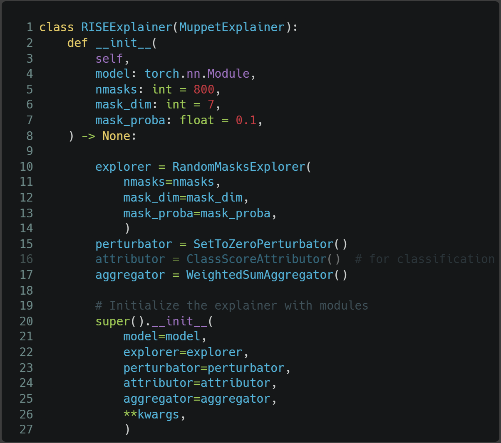
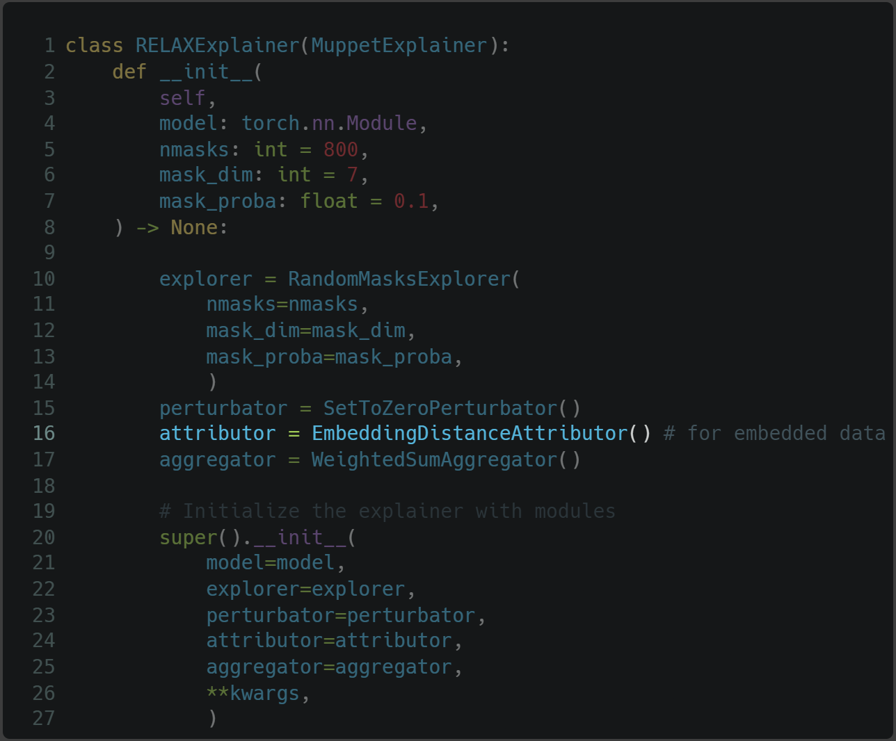
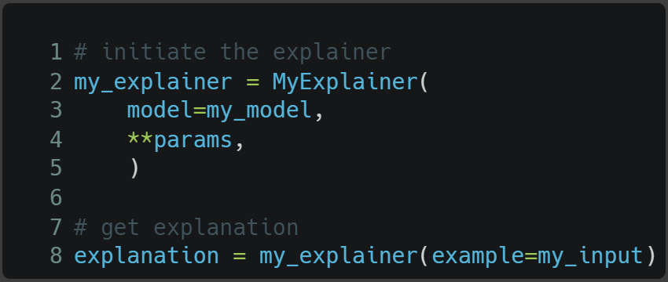
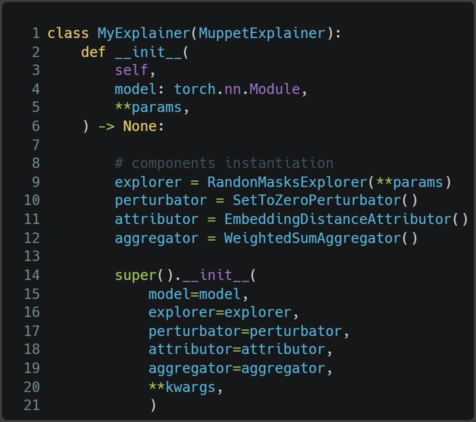

# MUPPET XAI

**Mu**lti**p**le **Pe**r**t**urbation e**X**plainable **A**rtificial **I**ntelligence: Is a multimodal python library for explaining and interpreting Pytorch models through perturbation-based XAI methods. It Supports all data modalities (including images, tabular data, time series, ...).

# Principle

Given a black-box model $f$ that only provides inference functionality, regardless of its inner working, and a data point $x$. The goal is to understand the prediction $f(x)$ made by the model by perturbing the input data feature values $x'$ and observing the model $f$ prediction on those perturbations.

The perturbation-based methods follow four steps:
1. Generate the masks to use for perturbing the input data $x$,
2. Apply those masks on the input data to get the $x'$,
3. Calculate feature scores/attributions of every perturbation from the model prediction on perturbed data $f(x')$ and on original data,
4. Finally aggregate the attributions to find the final local explanation such as feature importance, heat-maps, ...

# Quick Start

## Installation

### Installing MUPPET-XAI from PyPI

To install Muppet-XAI with pip from [PyPI](https://pypi.org/):

```bash
pip install muppet-xai
```

### Installing MUPPET-XAI for Development

First clone the repository:

```
git clone git@github.com:euranova/muppet.git
cd muppet/
```

MUPPET supports both standard and containerized environments for streamlined setup. Follow the instructions below depending on your preference.

#### Without Docker

1. Install [uv](https://docs.astral.sh/uv/getting-started/installation/)

2. Run the following command to install development and documentation dependencies:

```bash
uv sync --locked
```

#### With Docker (Recommended)

1. Build the development Docker image:

If you develop on a host machine with an NVIDIA GPU and the required drivers installed, build Docker image that supports CUDA:

```bash
docker build -f Dockerfile.cuda -t muppet/muppet:latest .
```

Otherwise, on machines without a dedicated NVIDIA GPU:

```bash
docker build -t muppet/muppet:latest .
```

2. Run a development container and open a VS Code window using the [Dev Containers extension](https://marketplace.visualstudio.com/items?itemName=ms-vscode-remote.remote-containers):

```bash
docker run -it --rm --gpus all -v /app/.venv -v $(pwd):/app --name muppet_dev muppet/muppet:latest /bin/bash
```

Alternatively, you can open the project directly via VSCode, **this method is recommended
because it ensures that every developer has the same dev environement, including VSCode extensions, settings,...**, by using:

**Command Palette** → `Dev Containers: Open Folder in Container...`

## Usage

```python

from muppet import FITExplainer

explainer = FITExplainer(model=my_model)

heatmap = explainer(example=x)

```

The example $x$ must be of shape `[b, **dim]` where b is the batch of example and dim is the data modality dimensions, E.g for one image (b=1, c=3, w=224, h=224).

## Working Example

Generate explanation heatmaps for images using the RISE method by referring to the [basic_explanation.ipynb](muppet/notebooks/basic_explanation.ipynb) notebook, or just run this piece of code from the root:

```python
from torchvision.models import get_model

from muppet import DEVICE
from muppet.benchmark.plot_explanation import plot_explanation_image
from muppet.benchmark.tools import load_imagenet_image
from muppet.explainers import RISEExplainer

# Prepare VGG-16 model,
model = get_model(
    name="vgg16",
    weights="IMAGENET1K_V1",
)
model.to(DEVICE)

# Prepare the image to explain its classification
image = load_imagenet_image(
    "muppet/tests/data/cat.jpg"
)  # (1, 3, 224, 224)

# Explain the image class prediction using RISE method
rise_explainer = RISEExplainer(model=model)
heatmap = rise_explainer(example=image)  # (b=1, c=1, w=224, h=224)

# plot heatmap
plot_explanation_image(
    example=image[0],
    explanation=heatmap[0][0],
    figure_title="Heatmap",
)
```

## Benchmark

The `Muppet` library includes a comprehensive benchmarking module located in the `muppet/benchmark/` directory. This tool is designed to evaluate and compare various Perturbation-based eXplanation (PXAI) methods across different models, datasets, and evaluation metrics, leveraging the four-block decomposition framework (Exploration, Perturbation, Attribution, Aggregation) presented in the paper.

### Features

*   **Configuration-Driven:** Powered by Hydra, allowing for flexible and extensive configuration of experiments via YAML files.
*   **Multi-Modality Support:** Easily benchmark explainers on different data types:
    *   Image
    *   Tabular
    *   Time Series
*   **Extensible Components:**
    *   **Datasets:** Pre-configured for standard datasets (e.g., ImageNet sample, UCI Dry Beans, AEON time series, synthetic spike data) and easily extendable for new ones. Data loading and preprocessing are managed through `DataModule`.
    *   **Models:** Includes wrappers for various model types (e.g., `torchvision` models like ResNet, VGG; `sklearn` models like RandomForest, XGBoost; `aeon` classifiers; custom PyTorch models like GRUs). Supports pre-trained models and hyperparameter tuning via Optuna for non-PyTorch models.
    *   **Explainers:** Integrates explainers implemented in `Muppet` (e.g., LIME, SHAP, RISE, MP, OptiCAM, ScoreCAM, FIT), structured according to the four-block decomposition.
    *   **Metrics:** Leverages the [Quantus](https://github.com/understandable-machine-intelligence-lab/Quantus) library for a wide range of XAI evaluation metrics and includes custom metric implementations (e.g., Sparseness, IROF). Metrics cover aspects like Faithfulness, Robustness, Complexity, and Randomisation.
*   **Automated Evaluation:** Runs experiments, computes predictions, and evaluates explanations systematically.
*   **Result Aggregation & Visualization:** Generates aggregated results and visualizations (e.g., heatmaps, bar plots) to compare explainer performance.

### Directory Structure

The `muppet/benchmark/` directory is organized as follows:

*   `conf/`: Contains all Hydra configuration files.
    *   `dataset/`: Configurations for different datasets.
    *   `explainer/`: Configurations for various explainers, categorized by data type.
    *   `metric/`: Configurations for evaluation metrics.
    *   `model/`: Configurations for different models.
    *   `hydra/`: Hydra-specific configurations (e.g., launcher, sweeper, callbacks).
    *   `image_config.yaml`, `tabular_config.yaml`, `timeseries_config.yaml`, `timeseries_spike_config.yaml`: Main configuration files for running proposed benchmarks on respective data modalities. These files define the default experiment setups and explainer suites.
*   `datasets/`: Scripts for data loading, preprocessing, and PyTorch `Dataset`/`DataLoader` management.
*   `metrics/`: Custom metric implementations and helper functions for metric evaluation.
*   `models/`: Model definitions and wrappers.
*   `notebooks/`: Jupyter notebooks for demonstrations and specific evaluations (e.g., `benchmark.ipynb`, `FIT_evaluation.py`).
*   `run_benchmark.py`: The main script to launch benchmark experiments using Hydra.
*   `plot_exp_result_callback.py`: Hydra callback for generating result summary plots.

### Running Benchmarks

To run a benchmark, you typically use the `run_benchmark.py` script with Hydra. Hydra allows you to specify a main configuration file and override parameters from the command line.

**General Command Structure:**

```bash
python muppet/benchmark/run_benchmark.py --config-name=<main_config_file> [overrides...]
```

### Examples:

*Note: `hydra.mode=MULTIRUN` is often used with a sweeper to run benchmark on multiple explainers in parallel jobs. This is efficient when memory isn't an issue. In contrast, `hydra.mode=RUN` executes the benchmarking for all configured explainers sequentially within a single process, more appropriate in case of image dataset.*

1.  **Run image benchmark with default settings:**
    (Defaults are specified in `image_config.yaml`, e.g., ResNet model, ImageNet dataset, and a suite of image explainers like MP, RISE, LIMEImage, OptiCAM, ScoreCAM)

  ```bash
  python muppet/benchmark/run_benchmark.py --config-name=image_config
  ```

2.  **Run tabular benchmark with default settings:**
    (Defaults are specified in `tabular_config.yaml`, e.g., RandomForest model, Dry Beans dataset, and a suite of tabular explainers like LIME variants and SHAP variants)

    ```bash
    python muppet/benchmark/run_benchmark.py --config-name=tabular_config hydra.mode=MULTIRUN
    ```

3.  **Run time series benchmark for a specific dataset (e.g., EthanolConcentration):**
    (Defaults are specified in `timeseries_config.yaml`)

    ```bash
    python muppet/benchmark/run_benchmark.py --config-name=timeseries_config dataset.name=EthanolConcentration dataset.loader.name=EthanolConcentration hydra.mode=MULTIRUN
    ```

4.  **Run image benchmark for a specific explainer (e.g., RISEExplainer) and a smaller test set:**

    ```bash
    python muppet/benchmark/run_benchmark.py --config-name=image_config dataset.test_size=50 hydra.mode=MULTIRUN +run_explainer=RISEExplainer
    ```
5. **Run image benchmark for image segmentation:**

   ```
   python muppet/benchmark/run_benchmark.py --config-name=image_seg_config
   ```
### Benchmark outputs

The benchmark tool typically generates:

**Raw metric scores**: Often saved in JSON or CSV files within the outputs/ or multirun/ directory (Hydra's default output locations).
**Aggregated results**: Processed results comparing explainers across different metrics.
**Visualizations**: Plots like heatmaps or violin plots summarizing explainer performance, potentially generated by callbacks like PlotExperiencesResultCallback.

Please refer to the configuration files in `muppet/benchmark/conf/` for detailed setup options and available components.

# Implement a new variant

In the example depicted in Figures below, we highlight the practicality and modularity of Muppet through its decomposition framework. Specifically, we examine the decomposition of RISE and RELAX, which are two distinct perturbation-based methods used for explaining image classification and image embeddings, respectively.

When RISE and RELAX are decomposed following our proposed methodology, it becomes intuitive to find the shared commonalities between these two methods as they only differ for
the modeling task and what to capture from the model behavior when presented with perturbed data. This simply says that RISE and RELAX share the same three components namely: Explorer, Perturbator, and Aggregator, and only differ for the Attributor module when generating explanations. Therefore, RELAX implementation requires only the development of one component, the Attributor, and it reuses all three others from the RISE method's implementation. This consistency in components underscores the adaptability of Muppet, showcasing its ability to accommodate various methods while maintaining a consistent modular structure. We refer the reader to detailed definitions of the methods' components provided in Appendix.

The presented example serves as a demonstration of how effortlessly new methods and variants can be developed in Muppet by assembling distinct but compatible modules tailored for each step in the explanation process. This flexibility not only streamlines the development process but also encourages innovation by allowing researchers to experiment with different combinations of modules to create new XAI methods.





Muppet is designed for simplicity and transparency, it allows easy explanation of ML models with minimal coding. As shown in the figure below, one simply initiates the desired explainer with the model to investigate, and by providing the input data, Muppet does the rest to generate an explanation. The generated explanation's format depends on the chosen explainer (e.g., saliency map for images). Muppet components are implemented to support diverse data modalities and, therefore, could be shared among different explainers.



As an open-source project, Muppet is designed in modularity to take advantage of the theoretical decomposition of PXAI methods and provide the research community with an easy-to-contribute-to framework. It offers a standardized API to ensure that contributions are not only straightforward but also adhere to a well-defined structure. Integrating a new method into the framework involves its decomposition into the four components: Explorer, Perturbator, Attributor, and Aggregator.
Each one represents a distinct step in the explanation process; each step corresponds to an independent module in our API, and as such can be easily swapped and re-used as building blocks for other methods.

As depicted in Figure below, once the modules are implemented or selected from the library, Muppet seamlessly manages the internal communication between components to create a ready-to-use explainer. This modular approach enhances components' reusability, allowing for experimental analysis of their behavior. It also enables the instantiation of different but compatible modules to yield new PXAI methods and variants.



Moreover, we acknowledge the crucial role of benchmarking capabilities of XAI methods and its demand from the research community. For this reason, Muppet offers, at the time of this writing, only some functionalities to evaluate the XAI methods such as faithfulness and robustness metrics. Muppet is currently in active development of a full benchmarking toolkit to evaluate XAI methods based on state-of-the-art models and datasets.

# Contact

For support please write to :

- Quentin Ferré - quentin.ferre@euranova.eu

- Antoine Bonnefoy - antoine.bonnefoy@euranova.eu

# Acknowledgements

For the development of the Muppet benchmark, we used source code from the [XAI-Bench](https://github.com/abacusai/xai-bench) library :

```bibtex
@inproceedings{xai-bench-2021,
  title={Synthetic Benchmarks for Scientific Research in Explainable Machine Learning},
  author={Liu, Yang and Khandagale, Sujay and White, Colin and Neiswanger, Willie},
  booktitle={Advances in Neural Information Processing Systems Datasets Track},
  year={2021},
}
```

This code has been modified to fit the specific needs of our project. The code from XAI-Bench included in this project is based on [commit](https://github.com/abacusai/xai-bench/commit/f0431a7c1628a8b66fd322ce86ddcba0d81201d5).
